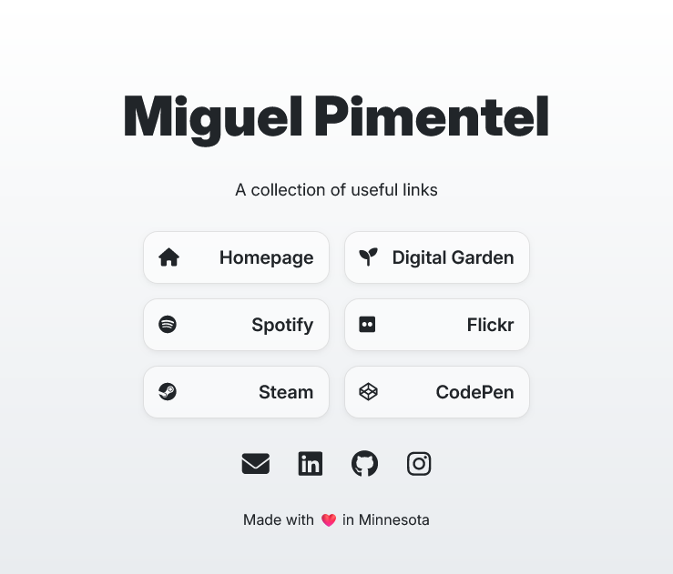
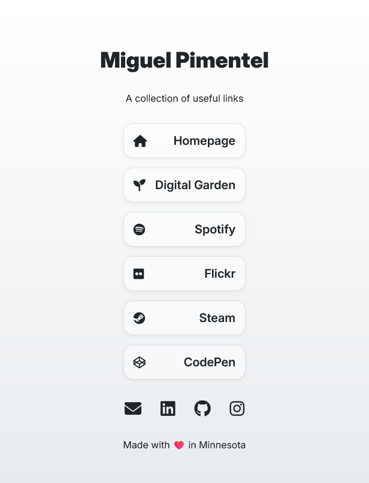

# Astro Linktree

A modern, responsive, and customizable Linktree clone built with [Astro](https://astro.build/). Perfect for creating a personal or professional link hub with a clean, minimal design.

|  |  |
| --- | --- |

## ✨ Features

- 🚀 Blazing fast performance with Astro's static site generation
- 📱 Fully responsive design that works on all devices
- 🎨 Customizable appearance through CSS variables
- 🔒 Enhanced security with proper link attributes
- ♿ Built with accessibility in mind
- 🌈 Modern gradient background (easily customizable)
- ⚙️ Simple configuration through `siteConfig.js`

## 🚀 Getting Started

### Prerequisites

- Node.js 18.0.0 or higher
- npm, pnpm, or yarn package manager

### Installation

1. Clone the repository:

   ```bash
   git clone https://github.com/semanticdata/linktree.git
   cd linktree
   ```

2. Install dependencies:

   ```bash
   pnpm install
   # or
   npm install
   # or
   yarn install
   ```

3. Start the development server:

   ```bash
   pnpm dev
   ```

   Your site will be available at `http://localhost:4321`

## 🛠 Configuration

Customize your linktree by editing the `siteConfig.js` file in the root directory:

```javascript
export const name = "Your Name";
export const subtitle = "Your subtitle or tagline";
export const description = "Your personal link hub";
export const footer = " 2025 Your Name. All rights reserved.";

export const cards = [
  {
    name: "My Portfolio",
    link: "https://your-portfolio.com",
    icon: "fas fa-globe"
  },
  // Add more cards as needed
];

export const links = [
  {
    link: "https://github.com/your-username",
    icon: "fab fa-github"
  },
  // Add more social links as needed
];
```

## 🎨 Customization

### Styling

Customize the look and feel by modifying the CSS variables in `src/style.css`:

```css
:root {
  --background-gradient-start: #1a1a2e;
  --background-gradient-end: #16213e;
  --text-color: #ffffff;
  --card-bg: rgba(255, 255, 255, 0.1);
  --card-hover: rgba(255, 255, 255, 0.2);
  --transition-speed: 0.3s;
}
```

### Icons

This project uses [Font Awesome](https://fontawesome.com/) for icons. You can use any icon from their free collection by adding the appropriate class to your links in the configuration.

## 📦 Building for Production

To create a production build:

```bash
pnpm build
```

This will generate a static site in the `dist/` directory ready for deployment.

## 🚀 Deployment

You can deploy your Astro Linktree to various hosting services. Here are some options:

- [Vercel](https://vercel.com/)
- [Netlify](https://www.netlify.com/)
- [GitHub Pages](https://pages.github.com/)
- [Cloudflare Pages](https://pages.cloudflare.com/)

### Vercel Deployment Example

1. Push your code to a GitHub repository
2. Import the repository to Vercel
3. Vercel will automatically detect the Astro project and configure the build settings

## 🤝 Contributing

Contributions are welcome! Please feel free to submit a Pull Request.

1. Fork the Project
2. Create your Feature Branch (`git checkout -b feature/AmazingFeature`)
3. Commit your Changes (`git commit -m 'Add some AmazingFeature'`)
4. Push to the Branch (`git push origin feature/AmazingFeature`)
5. Open a Pull Request

## 📄 License

Distributed under the MIT License. See `LICENSE` for more information.

## 🙏 Acknowledgments

- [Astro](https://astro.build/) - The web framework for content-driven websites
- [Font Awesome](https://fontawesome.com/) - For the beautiful icons
- [Font Source](https://github.com/fontsource/fontsource) - For the typeface packages
- [Inter](https://rsms.me/inter/) - The typeface used in this project
